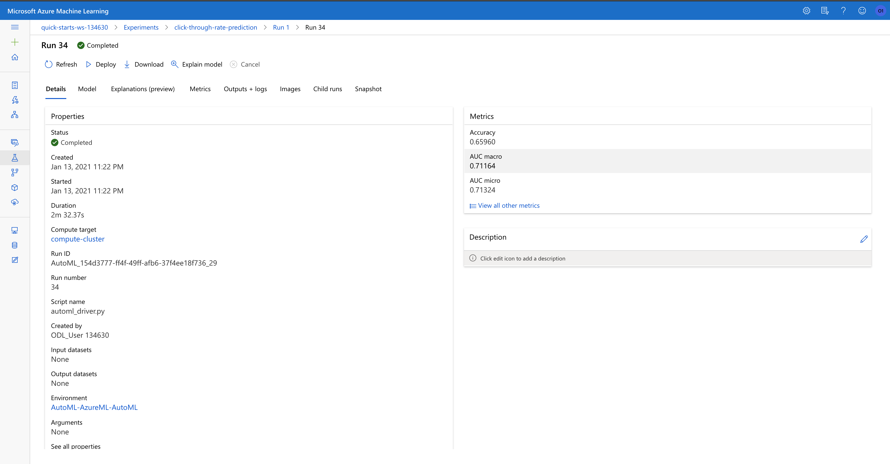
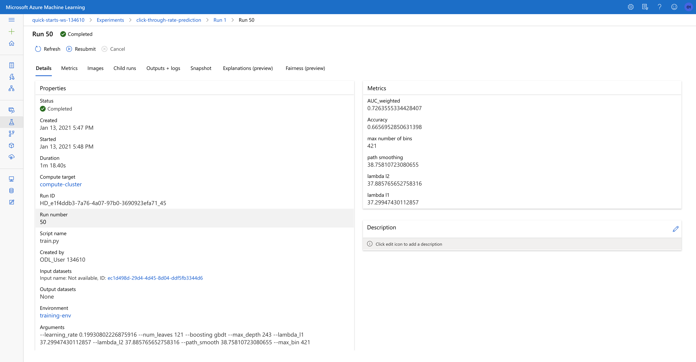

# Predict Ads Click Through Rate With Microsoft Azure

Ads click through rate is a key metric of measuring the success of company's marketing initiatives. Since setting up these advertisement efforts are relatively costly, we would like to spend more efforts in campaigns that are successful. Having a model that can predict the click through rate of each advertisement could be tremendously helpful for business to make smart decisions. In this project, we will build a simple more that can predict the click through rate of all the ads with the help from Microsoft Azure. We will use Azure's hyperdrive to tune a customized lightGBM model, and compare the performance with the models that are generated by an automated machine learning process. The superior model will eventually be deployed to Azure Kubernetes Serivce and opreationalized. 

## Project Set Up and Installation

To set up the project in Azure, perform the following 3 simple steps

1. Access Azure Machine Learning Studio and create a notebook instance
2. Upload the following files to notebook instance - `automl.ipynb`, `hyperparameter_tuning.ipynb`, `fetch_dataset.sh`, `train.py` and `utils.py`
3. Run both `automl.ipynb` and `hyperparameter_tuning.ipynb`, relevant dataset and compute clusters will be set up automatically

## Dataset

### Overview

The dataset is from Kaggle, originally used as the competition dataset of the 2020 DIGIX CTR Predicition competition. The full dataset is 6GB, contains 36 columns (some masked) describing advertising behavior for seven consecutive days. Specifically, the dataset includes

* **label** - Whether the customer clicked on an advertisement
* **uid** - Unique user ID after data anonymization
* **task_id** - Unique ID of an ad task
* **adv_id** - Unique ID of an ad material
* **creat_type_cd** - Unique ID of an ad creative type
* **adv_prim_id** - Advertiser ID of an ad task
* dev_id - Developer ID of an ad task
* **inter_typ_cd** - Display form of an ad material
* **slot_id** - Ad slot ID
* **spread_app_id** - App ID of an ad task
* **tags** - App tag of an ad task
* **app_first_class** - App level-1 category of an ad task
* **app_second_class** - App level-2 category of an ad task
* **age** - User age
* **city** - Resident city of a user
* **city_rank** - Level of the resident city of a user
* **device_name** - Phone model used by a user
* **device_size** - Size of the phone used by a user
* **career** - User occupation
* **gender** - User gender
* **net_type** - Network status when a behavior occurs
* **residence** - Resident province of a user
* **his_app_size** - App storage size
* **his_on_shelf_time** - Release time
* **app_score** - App rating score
* **emui_dev** - EMUI version
* **list_time** - Model release time
* **device_price** - Device price
* **up_life_duration** - HUAWEI ID lifecycle
* **up_membership_grade** - Service membership level
* **membership_life_duration** - Membership lifecycle
* **consume_purchase** - Paid user tag
* **communication_onlinerate** - Active time by mobile phone
* **communication_avgonline_30d** - Daily active time by mobile phone
* **indu_name** - Ad industry information
* **pt_d** - Date when a behavior occurs

### Task

For each advertisement, predict whether the customer is going to click on it in the near future.

### Access

The data is obtained programmatically using Kaggle's API hosted in the shell script `fetch_dataset.sh`. Since the dataset is rather big (6 GB), only a randomly sampled subset of the full dataset will be used as the training/test data. The general steps in the shell scripts involves

1. Install kaggle CLI tools
2. Download dataset from Kaggle
3. Unzip the dataset
4. Remove extra files - the downloaded zip file, 2 extra test data csvs
5. Rename train_data folder into data

2 additional steps performed before registering the dataset,

* After the train_data.csv has been downloaded, it will be iteratively read into the workspace, while only 1% of each chunk is saved and concatenated into the training dataframe
* Click history generation is performed on dataset, counting the aggregated click statistics for a single advertisment for the past n days. 

These 2 steps brings the total number of columns in this dataset to 66.

## Automated ML

General steps for creating the autoML experiment

1. Create Cluster
2. Download data
3. Click history generation
4. Register data
5. Configure autoML experiment
6. Submit autoML for execution
7. Register the best performing model

Visual diagram is shown below


When configuring the autoML experiment, parameters are chosen to be more restrictive on the length of the training process in order to prevent us from getting any unecessary costs. Specifically,

* `iteration_timeout_minutes` and `experiment_timeout_minutes` both controls the length of time taking to find the best model. As models found in general are very similar in performances, setting these 2 parameters to a reasonable amount will help us getting uncessary costs
* `primary_metric` set to "AUC_weighted" allows the model to adjust for imbalance in the dataset (though there is very little) and reflect the true performance for the model
* `featurization` set to "auto" for autoML to decide what features to generate
* `verbosity` set to "logging.INFO" for autoML to save all the execution related logs to the workspace for debugging purposes
* `n_cross_validations` set to 5 for autoML to test performances across 5 different folds to make the performance measure more robust

### Results

The best model obtained by the automated machine learning experiment is a stack ensemble model of 2 lightGBM, 3 xgboost and 2 logistic regression models, each with different sets of parameters, with a logsitic regression on top as the meta learner. Its AUC_weighted metric sits at 0.7116. To improve on this performance would require some additional feature engineerings. Using additional data does not guarantee better performances. Putting the feature engineering steps inside a pipeline with AutoML step will dramatically improve the efficiency of this machine learning solution. Specific run details are shown below in the screenshot


The best model run is shown as below



specific best model architecture's base learners and their parameters are the following

```python
'0': Pipeline(memory=None,
          steps=[('maxabsscaler', MaxAbsScaler(copy=True)),
                 ('lightgbmclassifier',
                  LightGBMClassifier(boosting_type='gbdt', class_weight=None,
                                     colsample_bytree=1.0,
                                     importance_type='split', learning_rate=0.1,
                                     max_depth=-1, min_child_samples=20,
                                     min_child_weight=0.001, min_split_gain=0.0,
                                     n_estimators=100, n_jobs=1, num_leaves=31,
                                     objective=None, random_state=None,
                                     reg_alpha=0.0, reg_lambda=0.0, silent=True,
                                     subsample=1.0, subsample_for_bin=200000,
                                     subsample_freq=0, verbose=-10))],
          verbose=False),
 '19': Pipeline(memory=None,
          steps=[('standardscalerwrapper',
                  <azureml.automl.runtime.shared.model_wrappers.StandardScalerWrapper object at 0x7fbcfbe6c240>),
                 ('xgboostclassifier',
                  XGBoostClassifier(base_score=0.5, booster='gbtree',
                                    colsample_bylevel=1, colsample_bynode=1,
                                    colsample_bytree=1, eta=0.001, gamma=0.1,
                                    grow_policy='lossguide', learning_rate=0.1,
                                    max_bin=1023, max_delta_step=0, max_depth=0,
                                    max_leaves=63, min_child_weight=1,
                                    missing=nan, n_estimators=25, n_jobs=1,
                                    nthread=None, objective='reg:logistic',
                                    random_state=0, reg_alpha=0,
                                    reg_lambda=1.7708333333333335,
                                    scale_pos_weight=1, seed=None, silent=None,
                                    subsample=0.9, tree_method='hist',
                                    verbose=-10, verbosity=0))],
          verbose=False),
 '20': Pipeline(memory=None,
          steps=[('maxabsscaler', MaxAbsScaler(copy=True)),
                 ('lightgbmclassifier',
                  LightGBMClassifier(boosting_type='gbdt', class_weight=None,
                                     colsample_bytree=0.8911111111111111,
                                     importance_type='split',
                                     learning_rate=0.05263631578947369,
                                     max_bin=110, max_depth=4,
                                     min_child_samples=693, min_child_weight=8,
                                     min_split_gain=0.5263157894736842,
                                     n_estimators=200, n_jobs=1, num_leaves=215,
                                     objective=None, random_state=None,
                                     reg_alpha=0, reg_lambda=0.2631578947368421,
                                     silent=True, subsample=0.3468421052631579,
                                     subsample_for_bin=200000, subsample_freq=0,
                                     verbose=-10))],
          verbose=False),
 '23': Pipeline(memory=None,
          steps=[('standardscalerwrapper',
                  <azureml.automl.runtime.shared.model_wrappers.StandardScalerWrapper object at 0x7fbcfbdfd0f0>),
                 ('logisticregression',
                  LogisticRegression(C=0.12648552168552957,
                                     class_weight='balanced', dual=False,
                                     fit_intercept=True, intercept_scaling=1,
                                     l1_ratio=None, max_iter=100,
                                     multi_class='ovr', n_jobs=1, penalty='l2',
                                     random_state=None, solver='newton-cg',
                                     tol=0.0001, verbose=0, warm_start=False))],
          verbose=False),
 '1': Pipeline(memory=None,
          steps=[('maxabsscaler', MaxAbsScaler(copy=True)),
                 ('xgboostclassifier',
                  XGBoostClassifier(base_score=0.5, booster='gbtree',
                                    colsample_bylevel=1, colsample_bynode=1,
                                    colsample_bytree=1, gamma=0,
                                    learning_rate=0.1, max_delta_step=0,
                                    max_depth=3, min_child_weight=1, missing=nan,
                                    n_estimators=100, n_jobs=1, nthread=None,
                                    objective='binary:logistic', random_state=0,
                                    reg_alpha=0, reg_lambda=1,
                                    scale_pos_weight=1, seed=None, silent=None,
                                    subsample=1, tree_method='auto', verbose=-10,
                                    verbosity=0))],
          verbose=False),
 '22': Pipeline(memory=None,
          steps=[('standardscalerwrapper',
                  <azureml.automl.runtime.shared.model_wrappers.StandardScalerWrapper object at 0x7fbcfbe04860>),
                 ('logisticregression',
                  LogisticRegression(C=0.2682695795279725,
                                     class_weight='balanced', dual=False,
                                     fit_intercept=True, intercept_scaling=1,
                                     l1_ratio=None, max_iter=100,
                                     multi_class='ovr', n_jobs=1, penalty='l2',
                                     random_state=None, solver='saga',
                                     tol=0.0001, verbose=0, warm_start=False))],
          verbose=False),
 '21': Pipeline(memory=None,
          steps=[('standardscalerwrapper',
                  <azureml.automl.runtime.shared.model_wrappers.StandardScalerWrapper object at 0x7fbcfbe080b8>),
                 ('xgboostclassifier',
                  XGBoostClassifier(base_score=0.5, booster='gbtree',
                                    colsample_bylevel=1, colsample_bynode=1,
                                    colsample_bytree=0.6, eta=0.1, gamma=0,
                                    grow_policy='lossguide', learning_rate=0.1,
                                    max_bin=63, max_delta_step=0, max_depth=6,
                                    max_leaves=0, min_child_weight=1,
                                    missing=nan, n_estimators=800, n_jobs=1,
                                    nthread=None, objective='reg:logistic',
                                    random_state=0, reg_alpha=1.1458333333333335,
                                    reg_lambda=0.5208333333333334,
                                    scale_pos_weight=1, seed=None, silent=None,
                                    subsample=0.5, tree_method='hist',
                                    verbose=-10, verbosity=0))],
          verbose=False),
```

The metalearner's architecture and parameters are the following

```python

LogisticRegressionCV(Cs=10,
                    class_weight=None,
                    cv=None, dual=False,
                    fit_intercept=True,
                    intercept_scaling=1.0,
                    l1_ratios=None,
                    max_iter=100,
                    multi_class='auto',
                    n_jobs=None,
                    penalty='l2',
                    random_state=None,
                    refit=True,
                    scoring=<azureml.automl.runtime.stack_ensemble_base.Scorer object at 0x7fbcfbe11400>,
                    solver='lbfgs',
                    tol=0.0001,
                    verbose=0),
                    training_cv_folds=5)
```

## Hyperparameter Tuning

Steps for creating hyperdrive experiment

1. Create Cluster
2. Download data
3. Click history generation
4. Register data
5. Build `train.py` entry point for hyperdrive
6. Define hyperdrive config object, using `train.py` as entry point
7. Submit hyperdrive for execution
8. Register the best performing model

visual diagram of the process is shown below


The model used to solve this problem will be LightGBM, it's a gradient boosting framework that uses tree based learning algorithms, designed for better speed, accuracy and volumne. Normally non-linear problems will yield fantanstic performances using LightGBM. Parameters tuned in the model controls different aspects of the model, for more information about the parameters visit [here](https://lightgbm.readthedocs.io/en/latest/Parameters-Tuning.html). Specifically,

* `max_depth`, `max_bin` and `num_leaves` controls the complexities of the trees built by the model. The lower these values are, the faster the model will be completing its training process
* `learning_rate` contorls the accuracy of the model, but could potentially lead to longer training time and overfitting, the lower this value is, the more accurate the model will be (more likely to overfit as well)
* `boosting` controls the boosting methods the model used during its training, choices are ["gbdt", "rf", "dart", "goss"]
* `lambda_l1` and `lambda_l2` controls the regularizations (l1 and l2 respectively) of the model, which reduces overfitting effect, but might lead to lower accuracies. The higher these values are, the less likely the model will be prone to overfitting, but too high values could lead to lower performances
* `path_smooth` controls smoothing applied to tree nodes, which helps prevent overfitting on leaves with few samples. The lower this value is, the less smoothing is applied

Using an early stopping policy allow us to cancel the runs that are using hyperparameters that lead to really bad performances. This will save us valuable runtime and computing resources to avoid paying for runs we would not use. The early termination policy used here is Bandit Policy. Bandit is an early termination policy based on slack factor/slack amount and evaluation interval. The policy early terminates any runs where the primary metric is not within the specified slack factor/slack amount with respect to the best performing training run.

Additional hyperdrive config settings are, 

* To match up the metric with the autoML experiment, the primary parameter is set to "AUC_weighted"
* Higher AUC values indicate better performances, the primary metric goal is set to "maximize"
* `max_total_runs` and `max_concurrent_runs` controls the training speed and cocurrency. `BayesianParameterSampling` requires at least 160 runs to get the best results, therefore 160 runs is the minimum value to execute the experiment as fast and accuracte as possible. Higher cocurrency will also lead to faster completion for the experiment as well.


### Results
*TODO*: What are the results you got with your model? What were the parameters of the model? How could you have improved it?

The best hyperdrive run produced a model that has 0.726 weighted AUC. The additional feature engineering performed in the `train.py` has improved the model performance, making it superior than all the automated machine learning runs. Additional feature engineering experiment could even push the model to be better.Same as autoML, this who process could be wrapped inside a pipeline. Specific run details are shown below in the screenshot


The best run and its hyperparameters are shown below



Specifically, the best model run's achitecture and parameters is

```python
LGBMClassifier(boosting='gbdt', boosting_type='gbdt', class_weight=None,
               colsample_bytree=1.0, importance_type='split',
               lambda_l1=37.29947430112857, lambda_l2=37.885765652758316,
               learning_rate=0.19930802226875916, max_bin=421, max_depth=243,
               min_child_samples=20, min_child_weight=0.001, min_split_gain=0.0,
               n_estimators=100, n_jobs=-1, num_leaves=121, objective=None,
               path_smooth=38.75810723080655, random_state=None, reg_alpha=0.0,
               reg_lambda=0.0, silent=True, subsample=1.0,
               subsample_for_bin=200000, subsample_freq=0)
```

## Model Deployment
*TODO*: Give an overview of the deployed model and instructions on how to query the endpoint with a sample input.

## Screen Recording

The recorded problem solving process could be found [here](https://youtu.be/be9q4-L7dUk)
